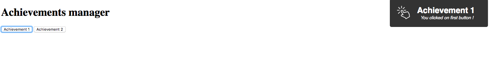
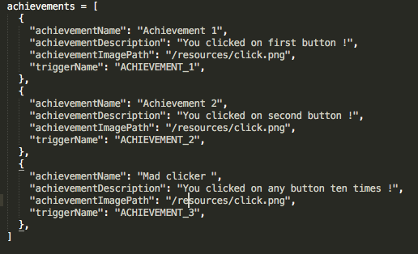
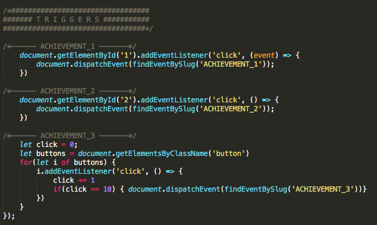

## Project overview

This is an achievement manager. It allows you to create and manage achievements for your game or application.

Follow these steps to set it up.

## How does it work ?

All the logic is contained in two files. The `achievements.json` and the `ach_manager.js`. Let's explore them.

### The achievements.json file

The first one is a big json containing all your achievements.
You can specify the name and the description of this achievement which will appears in the modal when the achievement is unlocked.
There's also a variable for the achievement's image local path.
The most important thing is the triggerName, which is the name of the event you will fire when you'll want the achievement to be unlocked.

### The ach_manager.js

In the ach_manager.js, EventListeners are created, attached to each achievements and wait for the event named after whatever triggerName you gave to it to be fired. All of these happens above the TRIGGERS separator and do not need to be modified.

Below the TRIGGERS section is where you are going to create the unlocking logic for each achievement. 
Here, it's simple clicks on  specific buttons retrieved by their id's and a slighty more complex one where 10 click on any button will fire it.
The important part which is mandatory is to dispatch the right triggerName when you want the achievment to be unlocked.

## So, what do I have to do to use it ?

Create an achievements.json file in your project to store all your achievements.
Grab the ach_manager.js file, and below to TRIGGERS section, add logic for each one of your achievements.
In your templates, a div with the `achievement-container` class is needed to show the modal.